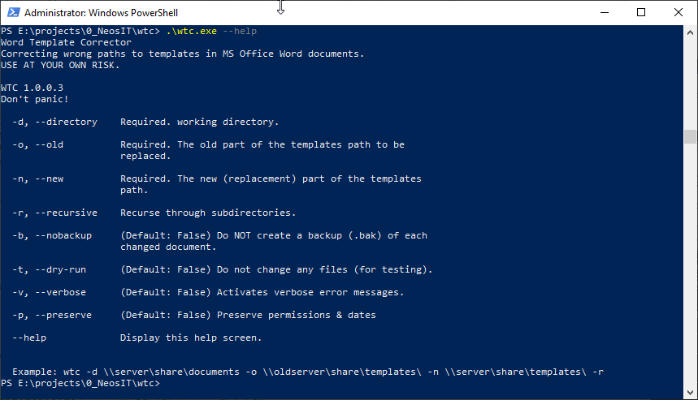

# WTC
The Word Template Corrector

# At a glance
WTC is a commandline tool to correct old/invalid paths to template files in
Microsoft Office Word documents in Office Open XML format (since Word 2003).

Those wrong path can be very annoying. If you're opening a document based on a template and the path to template has changed it can take a long, long time for the
document to open.

WTC was build to correct those invalid template paths in many documents very quickly (for example after the workgroup templates were moved to another server or share).

# Compatibility
* .NET Framework 4.5+
* Word 2003 (.docx, .dotx, .docm, .dotm)

# Build
Use Visual Studio 2015 to build.

The single binary that includes the CommandLine.dll is created with [ILMerge](https://www.microsoft.com/en-us/download/details.aspx?id=17630). If you like GUIs you can use [ILMerge-GUI](https://ilmergegui.codeplex.com/).

Command to create single binary:
```
ILMerge.exe /ndebug /targetplatform:4.0 /out:<path-to-wtc-folder>\bin\wtc.exe <path-to-wtc-folder>\wtc\bin\Release\WTC.exe <path-to-wtc-folder>\wtc\bin\Release\CommandLine.dll
```
_Replace `<path-to-wtc>` with your local wtc development folder._

For releases, you can use the `release.bat` in the root directory, which executes the ILMerge command above.

# Binaries
Binaries are no longer shipped inside this repository. You can either download the source code and build it on your own or [purchase a pre-compiled binary on Gumroad](https://gum.co/cbuME)


# Usage
## Options
* `--help`  
Shows a help screen
* `-d, --directory` (required)  
Path to the documents directory
* `-o, --old` (required)  
Path or part of a path to the template or the template directory which must be replaced
* `-n, --new` (required)  
The replacement for the path or the part of the path (see above)
* `-r, recursive` (optional)  
Also correct documents in all subfolders
* `-b, --nobackup` (optional)  
Do **not** create backup files for corrected documents.
* `-t, --dry-run` (optional)  
Use test mode. Only searching for documents to be corrected but the documents will not be changed.
* `-v, --verbose` (optional)  
Show verbose error messages.
* `-p, --preserve` (optional)  
Preserve LastAccessTime/LastWriteTime/CreationTime/Attributes/ACL.

## Example
`wtc -d \\server\share\documents -o \\alter-server\share\templates\ -n \\server\share\templates\ -r`

## Screenshots
### Helppage
`wtc --help`



### WTC in action
`wtc -d c:\temp\ -o \\192.168.0.10\ -n \\myserver\ -r`


### Dry-Run
`wtc -d c:\temp\ -o \\192.168.0.10\ -n \\myserver\ -r --dry-run`


# Credits
Thanks to [Giacomo Stelluti Scala](https://github.com/gsscoder) for his great [Command Line Parser Library](https://github.com/gsscoder/commandline).

# Detailierte Beschreibung (Deutsch)

## Was ist WTC?
WTC korrigiert Pfadangaben zur Dokumentenvorlagen in Microsoft Office
Word-Dateien (ab Word 2003).

## Das Problem
Erzeugt man Dokumente mit Microsoft Word auf Basis von Vorlagen, so wird im
Word-Dokument auch der Pfad die dieser Vorlage gespeichert. In Unternehmen
wird oft eine gemeinsame Sammlung von Vorlagen, die auf einem Server liegt,
genutzt. So weit so gut.

Ändert sich nun der Pfad zum Vorlagenverzeichnis wird die Sache unangenehm.
Insbesondere die Änderung der Serverangabe ist problematisch. Zum besseren
Verständnis hier mal ein Beispiel:

* Alter Pfad zu den Vorlagen: `\\alter-server\share\templates\`
* Neuer Pfad zu den Vorlagen: ´\\neuer-server\share\templates\`
* Der alte Server existiert nicht mehr.

Öffnet man nun ein Word-Dokument, dass mit einer Vorlage vom alten Server
erzeugt wurde, versucht Word die Vorlage von dort zu laden. Da der Server
aber gar nicht mehr existiert, versucht Word das so lange, bis es in einen
Timeout läuft. Und das kann leider gefühlt, sehr lange dauern.

## Die Lösung
Die Lösung ist naheliegend. In den betroffenen Dokumenten muss **nur** der
Pfad zur Dokumentenvorlage geändert werden. Dazu findet man im Netz viele
Lösungen, die aber fast alle eines gemein haben:
* basieren auf VBA und laufen innerhalb von Word oder Excel,
* sind langsam,
* verarbeiten keine Verzeichnisbäume
* geben keine vernünftigen Fehlermeldungen aus,
* können nicht adäquat von der Kommandozeile genutzt werden.

WTC macht das anders, was allerdings zu einer Einschränkung führt. **WTC
funktioniert nur für Dokumente im Format Office Open XML, das mit Office 2003
eingeführt wurde. Die gebräuchlichen Dateiendungen sind .docx, dotx, docm und
dotm.** Diese Dateien sind im Grunde eine Sammlung von
XML-Dateien, die in ein ZIP-Archiv verpackt sind. Ja tatsächlich. Man kann die
Dokumente ganz einfach mit einem Programm wie 7Zip öffnen oder entpacken.

## So arbeitet WTC
Das Prinzip ist simpel. Datei für Datei wird entpackt und dann wird in der
Einstellungsdatei `word\_rels\settings.xml.rels` die alte und unerwünschte
Pfadangabe zur Vorlage durch die neue, korrekte ersetzt. Danach wird alles
wieder eingepackt und die Originaldatei ersetzt. Standardmäßig wird dabei eine
Sicherungskopie des Originals mit der Endung .bak erzeugt.

## Die Optionen
* `--help`  
Ausgabe der möglichen Optionen
* `-d, --directory` (required)  
Alle Dokumente in diesem Verzeichnis werden bearbeitet.
* `-o, --old` (required)  
Pfad oder Teil des Pfades zur Vorlage bzw. dem Vorlagenverzeichnis der ersetzt werden soll.
* `-n, --new` (required)  
Durch diesen Pfad oder Teilpfad wird ersetzt.
* `-r, recursive` (optional)  
Bearbeite auch die Dokumente in den Unterverzeichnissen.
* `-b, --nobackup` (optional)  
Es werden **keine** Sicherungsdateien für korrigierte Dokumente angelegt.
* `-t, --dry-run` (optional)  
Testmodus benutzen. Es wird nach zu ändernden Dokumenten gesucht, sie werden aber nicht verändert.
* `-v, --verbose` (optional)  
Es werden ausführlichere Fehlermeldung ausgegeben.

## Beispiel
`wtc -d \\server\share\documents -o \\alter-server\share\templates\ -n \\server\share\templates\ -r`